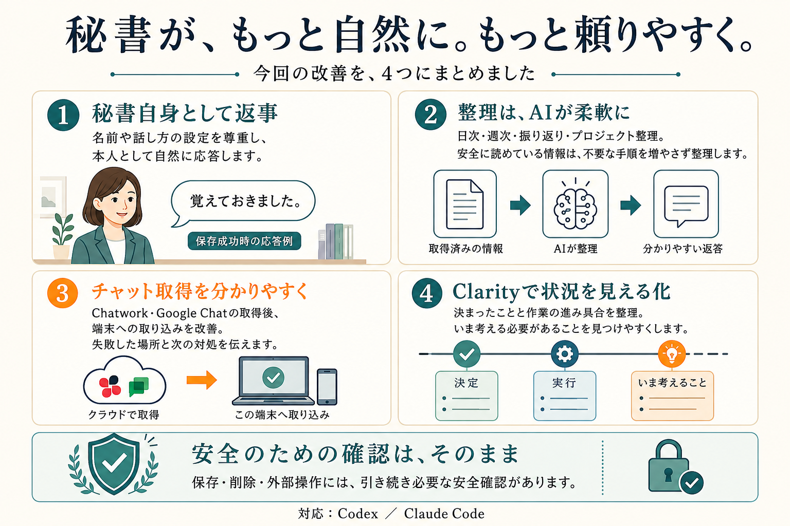

# 0.12.0への更新依頼文（Claude Code用）

対象repoの `v0.12.0` Release公開を確認してから利用してください。公開状態はReleaseページが正本です。Releaseがなければ、下の依頼文はファイルを変更せず停止します。

普段、秘書を使っているフォルダでClaude Codeを開き、利用中の版に合う文章を1回貼ってください。「1回貼る」は、危険な上書きや判断が必要な衝突まで無確認で進めるという意味ではありません。

プラグイン本体の更新と、利用者のフォルダに以前コピーされたファイルの更新は別です。後者は名前・話し方・記憶・独自の指示を残しながら必要な箇所だけを扱います。通常の更新処理が変更済みファイルを保護して止まった場合、その保護を無効にして進めません。

公開確認: [Agentic Secretary 0.12.0](https://github.com/mtaiseeei/agentic-secretary/releases/tag/v0.12.0) ／ [やさしい秘書 0.12.0](https://github.com/mtaiseeei/yasashii-secretary/releases/tag/v0.12.0)。未公開ならリンク先は表示されません。

## Agentic Secretary版

```text
このフォルダで使っている公開版Agentic Secretaryを、私のカスタマイズを残して0.12.0へ更新してください。この依頼を、安全に差分を確定できる範囲の更新への承認とします。

正規配布元は mtaiseeei/agentic-secretary、plugin IDは agentic-secretary@agentic-secretary です。最初に実際の導入元・版・scope・有効状態、作業フォルダの実pathとGitの変更状態を読み取り確認してください。名前だけが同じprivate/my-vault版、別版、別repoなら変更せず違いを教えてください。Git repoでなくてもgit initはしないでください。

更新前に現在のplugin rootの版・pathを記録し、コピー済みファイルの照合に必要な旧配布原本を、利用者データとは分けてworkspace外の版名付きローカル退避先に確保してください。update Skillの読み取り専用診断を優先し、基準版・所有権が分からないファイルは変更しないでください。退避先と復元方法を最後に示してください。marketplaceはmainの現在bytesを取得し得るため、更新前と後に取得対象の版と配布内容が公開0.12.0と一致することを確認し、確認できなければその対象を更新しないでください。

1. 正規repoの公開済みv0.12.0 Releaseと対応commit、配布manifest、CHANGELOGを確認してください。未公開・不一致・取得不能なら推測で進めないでください。すでに0.12.0より新しい正式版を使っている場合は戻さず、その旨を教えてください。mainがさらに先へ進んでいる場合も、別versionをこの承認で入れないでください。
2. plugin本体、local marketplace/fork、workspaceへコピー済みの製品ファイルを分けてください。今回変更するファイルと復元方法を短く示し、その対象だけをGit管理外のローカル退避先へ保護してください。記憶、日誌、プロジェクト本文、名前、口調、自由記述、認証情報、他plugin、無関係なstaged/unstaged/untrackedは更新対象から除外してください。機密本文を表示・外部送信したり、退避物を公開repoへ入れたりしないでください。
3. 未変更のpluginは、現在のClaude Codeが提供する正式なmarketplace更新・plugin更新を、確認したIDと既存scopeへ限定して行ってください。CLIではhelpを確認し、対象marketplaceだけの更新と claude plugin update agentic-secretary@agentic-secretary --scope <確認したscope> を使います。全marketplace更新、uninstall、prune、cache直接編集、scope変更、無効pluginの自動有効化はしないでください。local sourceやforkの変更があるなら、先にその差分を保護・整理し、登録先を勝手に公式へ付け替えないでください。
4. workspaceに製品由来の古い指示が残っている場合は、旧配布原本・現在の編集内容・0.12.0原本を照合し、製品所有部分だと根拠を持って判断できる箇所だけを最小差分で更新してください。独自の指示と新しい安全ルールが衝突する場合、基準版が不明な場合、通常の更新ツールがcustomized等で拒否した場合は、その対象だけを止めて具体的な違いを示してください。台帳の偽装、baselineの書換え、guardの迂回、全面上書き、stash、reset、clean、利用者変更の自動commitやpushで通してはいけません。
5. 更新後に導入版・source・scope・有効状態と差分を再確認してください。記憶や設定が保持されたことを本文の表示なしで確認し、利用中のClaude Codeが対応していれば /reload-plugins、非対応なら再起動を案内してください。まだ実行していないreloadや新session読込を完了扱いにしないでください。

最後は「本体の更新」「コピー済みファイルの反映」「読み込み確認」「保持したもの」「残った確認」「復元先」を短く報告してください。0.12.0のClarity、秘書自身としての返事、柔軟な整理、チャット取得改善が配布物に含まれることは確認しますが、私の実データを使った書込み・初期化・同期テストは行わないでください。
```

## やさしい秘書版

```text
このフォルダで使っている「やさしい秘書」を、私の名前・話し方・記憶・自分で変えた設定を残して0.12.0へ更新してください。この依頼を、安全に変更箇所を確定できる範囲の更新への承認とします。

正規配布元は mtaiseeei/yasashii-secretary、plugin IDは yasashii-secretary@yasashii-secretary です。最初に本当にこの版を使っているか、導入元・版・利用範囲(scope)・有効状態、作業フォルダとGitの変更状態を確認してください。Agentic版やprivate版など別のものなら、変更せず教えてください。Git repoでないフォルダを新しくGit管理にしないでください。

更新前に今のプラグインの版・保存場所を記録し、比較に必要な元の配布ファイルを、私の記憶や設定とは分けて作業フォルダ外の版名付きローカル退避先へ残してください。秘書のupdate Skillで読み取り確認を先に行い、元の版や製品所有部分が分からないファイルは変更しないでください。戻す場所と方法も最後に教えてください。marketplaceはmainの現在の内容を取得する場合があるため、更新前と後に対象が公開0.12.0の配布内容と一致するか確認し、確認できない対象は更新しないでください。

1. 正規repoでv0.12.0 Releaseが公開済みで、commit・配布情報・変更説明の版が一致していることを確認してください。未公開、不一致、確認できない場合は止めてください。すでに新しい正式版なら古い版へ戻さず、main上に別versionがある場合も勝手にそれを入れないでください。
2. 秘書のプラグイン本体と、このフォルダへ以前コピーされた指示・設定を分けて調べてください。変更する箇所と戻し方を短く示し、その対象だけをGit管理外のローカル退避先へ保護してください。記憶、日誌、プロジェクト本文、名前、口調、自由記述、認証情報、他plugin、無関係な作業中ファイルは触らないでください。機密本文の表示・外部送信や、退避物の公開repoへの保存もしないでください。
3. 本体に独自変更がなければ、現在のClaude Codeの正式な更新機能で、対象marketplaceと yasashii-secretary@yasashii-secretary だけを既存scopeへ更新してください。CLIのhelpを確認して、対象marketplace更新と claude plugin update yasashii-secretary@yasashii-secretary --scope <確認したscope> を使います。すべてのmarketplace更新、削除して入れ直すこと、prune、cacheの直接編集、scope変更、無効pluginの自動有効化はしないでください。local sourceやforkに変更があれば、差分を先に保護し、登録元を勝手に付け替えないでください。
4. コピー済みの指示に更新が必要なら「元の配布内容・今の私の変更・0.12.0」を比べ、製品由来と判断できる部分だけを小さく更新してください。私の希望と新しい安全ルールがぶつかる、元の版が不明、通常の更新ツールが変更済みとして止まる場合は、その箇所だけ止めて、私が決める必要のある点を平易に説明してください。保護機能や台帳を改変して通す、全面上書き、stash、reset、clean、利用者変更の自動commit・pushは禁止です。
5. 更新後は版・導入元・scope・有効状態と変更箇所を確認してください。私の記憶・設定の保持は、本文を表示せず確認してください。対応していれば /reload-plugins、非対応ならClaude Codeの再起動を案内してください。まだ読み込まれていない新版を「使えるようになった」と言わないでください。

最後に「更新できたこと・そのまま残したもの・私の確認が必要なこと・戻し方」を短く教えてください。Clarity、秘書自身としての自然な返事、AIによる柔軟な整理、チャット取得改善が配布物にあることを確認し、私の実データへの書込み・初期化・同期テストはしないでください。
```

## 更新後の変化



## コマンドの確認先

Claude Codeのplugin更新は対象IDとscopeを指定できます。実際の導入先のCLI helpも確認してください。[公式plugin reference](https://code.claude.com/docs/en/plugins-reference#plugin-update)

plugin変更後の読み込みには、対応版では `/reload-plugins` を利用できます。再起動が必要な版ではその案内に従います。[公式の読み込み案内](https://code.claude.com/docs/en/discover-plugins#apply-plugin-changes-without-restarting)
